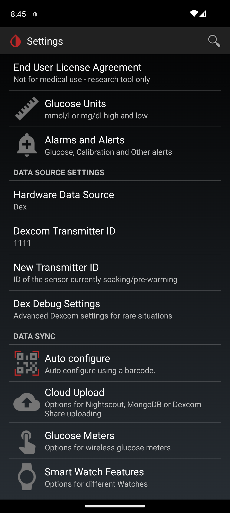
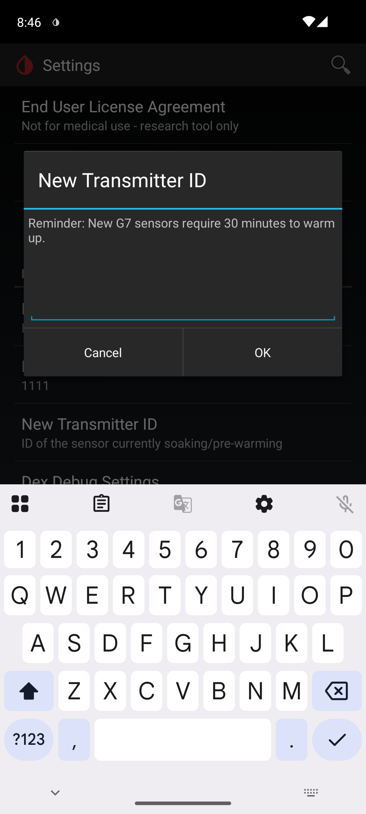
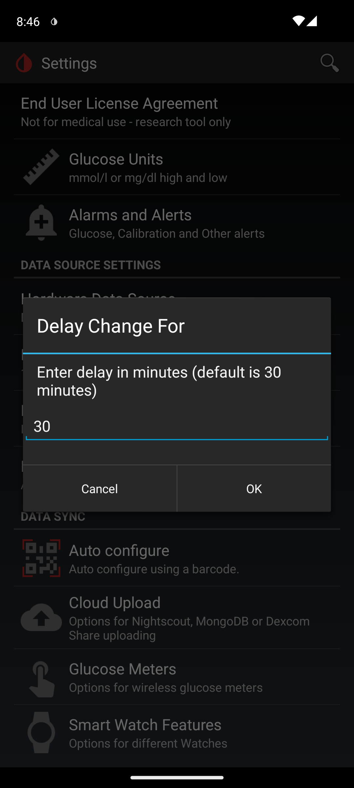
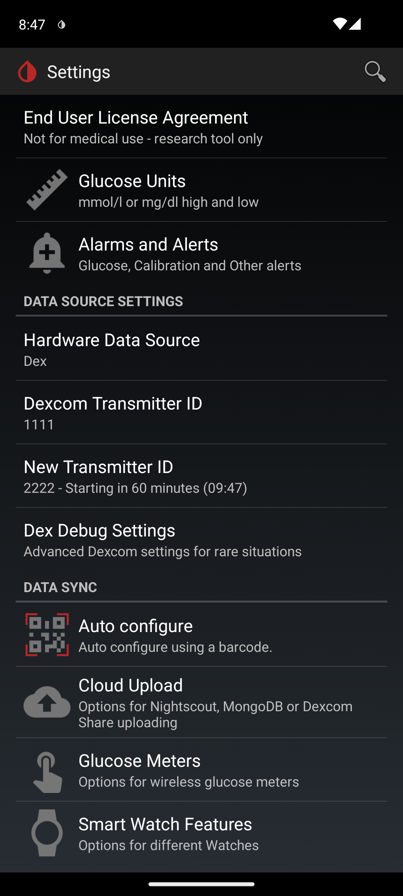
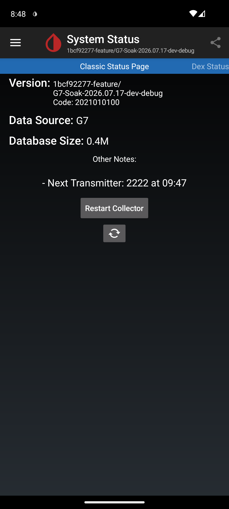

# Scheduled Transmitter ID Switch (G7 Soak & Handoff)

This optional feature lets you queue the **next** sensor's pairing code ahead of time and have
xDrip perform the changeover for you at a scheduled moment, instead of doing every step by hand at
an inconvenient time.

It is aimed at the **end-of-life handoff**: you insert the new sensor an hour or two before the
current one expires (a short "soak"), and let xDrip drive the switch. It is **not** a way to run two
sensors at once, and it does not read data from the new sensor before the switch — it only schedules
a transmitter-ID change.

> **Optional.** If you never enter a "New Transmitter ID", nothing about xDrip's normal behaviour
> changes.

## Requirements

- A Dexcom collector using the OB1 backend (G5/G6/One/G7/One+).
- A single field in **Settings → Hardware Data Source → your Dexcom source**.

## How it works

The whole flow is two short interactions with the phone, and fewer than five taps.

### 1. Queue the next sensor

1. Insert the new sensor.
2. Go to **Settings → Hardware Data Source → (your Dexcom source)** and tap **New Transmitter ID**.
   Its summary reads *"ID of the sensor currently soaking/pre-warming"* when empty.

   

3. Enter the new sensor's pairing code and confirm. On a G7 the entry dialog reminds you:
   *"Reminder: New G7 sensors require 30 minutes to warm up."*

   

4. A **Delay Change For** dialog appears: *"Enter delay in minutes (default is 30 minutes)."*
   - It pre-fills with the delay you used **last time** (or 30 if you've never set one), so on a
     normal changeover you can just accept it.
   - The delay is **capped at the end of the current sensor's life**. If you enter more, xDrip
     trims it and tells you: *"Delay capped at end of sensor life: N mins."*

   

5. Done. The field's summary now shows the queued ID, the minutes remaining, and the target time,
   e.g. `2222 - Starting in 60 minutes (09:47)`.

> **Note:** the switch may fire up to a minute before the target time, so it isn't missed in the
> gap between reading cycles. A practical consequence is that a very short delay (a minute or two)
> effectively becomes due straight away; the default of 30 minutes and any normal soak time are
> unaffected.

   

The pending switch also appears under **System Status → Other Notes**, so you can confirm it at a
glance:

### 2. Perform the switch

1. When the scheduled time arrives, xDrip raises a **New Sensor Ready** notification titled
   *"New Sensor Ready"* with the text *"Please go to System Status to switch sensors."* (It is
   re-raised at most once an hour until you act on it.)
2. Tap the notification. It opens the status pages on the **Dex** collector/transmitter status
   screen, where you can watch the handoff.
3. Opening the status screen performs the switch automatically: xDrip sets the new ID, clears the
   old session's data, and restarts the collector. You'll see a confirmation toast:
   *"Automatically switched to new Transmitter ID: …"*.
4. Approve the Android **Bluetooth pairing request** when it appears (this step is required by
   Android and cannot be automated), then remove the old sensor.

## Reviewing, changing, or cancelling a pending switch

- **See it at a glance:** the **New Transmitter ID** summary always shows the queued ID and target
  time. Pending switch details also appear in **System Status → Notes**.
- **Change it:** tap the **New Transmitter ID** row again to re-open the delay dialog and adjust the
  timing.
- **Cancel it:** clear the **New Transmitter ID** field (enter a blank). This removes the queued ID,
  the timer, and the stored delay.
- **Automatic cleanup:** if you change the **active** Transmitter ID manually, any pending switch is
  cleared automatically, so the two can't fight.

## Behaviour across reboots and app restarts

The queued ID and switch time are stored in xDrip's preferences, so they **survive a reboot, a
crash, or a force-stop** — the schedule is not lost.

**Limitation to be aware of:** the "New Sensor Ready" notification is raised on xDrip's normal
reading cycle, not by a dedicated system alarm. In practice, for the intended use case — switching a
sensor that is still active and delivering readings — the notification appears within a few minutes
of the target time. However, if xDrip is not running and no data is flowing at the scheduled time
(for example the old sensor has already expired **and** the app has been force-stopped), the
notification will not appear until xDrip is open and receiving data again. The switch itself always
waits for you to open the status screen, so nothing changes without your involvement.

## What this is not

- It does **not** connect to, or read data from, the new sensor before the switch. If you want to
  verify a new sensor's health during a long overlap, or run a 12-hour soak while watching both
  sensors, see the separate "subsequent sensor" guidance for using a second xDrip instance.
- It does **not** change how xDrip scans for or connects to sensors. The switch uses the exact same
  code path as a manual Transmitter ID change, so it is no different on the Bluetooth side from
  doing it by hand.

> **Two live G7s nearby:** as with a manual changeover, if the old sensor is still powered and close
> to the phone when you switch, it can interfere with connecting to the new one. Moving the old
> sensor well away (or removing it) at switch time avoids this.
