xDrip+ Wear Setup and Troubleshooting Guide
======================================
**Table of Contents**
- [Choosing a Watch](#choosing-a-watch)
- [Enable xDrip+ Android Wear Integration](#enable-xdrip-android-wear-integration)
    - [Patching Watch Firmware](#patching-watch-firmware)
    - [Collector](#collector)
        - [xDrip+ System Status](#xdrip-system-status)
    - [Initial Wear Enablement Requests Location Permission](#initial-wear-enablement-requests-location-permission)
    - [Syncing Phone and Wear Preferences](#syncing-phone-and-wear-preferences)
    - [Syncing BGs and Wear Database](#syncing-bgs-and-wear-database)
    - [XDrip Prefs Overview](#xdrip-prefs-overview)
        - [XDrip BT Settings](#xdrip-bt-settings)
        - [XDrip Watchface Settings](#xdrip-watchface-settings)
        - [Watchface Tap Feature](#watchface-tap-feature)
        - [Battery Usage](#battery-usage)
    - [3-Dot Menu](#3-dot-menu)
    - [XDrip Treatments](#xdrip-treatments)
- [Troubleshooting xDrip+ Wear](#troubleshooting-xdrip-wear)
    - [Confirm Collector runs on the Phone with Wear Integration](#confirm-collector-runs-on-the-phone-with-wear-integration)
    - [Confirm Collector runs on the Watch with Wear Integration](#confirm-collector-runs-on-the-watch-with-wear-integration)
    - [Confirm the following in Android Wear app on phone](#confirm-the-following-in-android-wear-app-on-phone)
    - [Confirm Wear Integration preferences are consistent on both phone and watch](#confirm-wear-integration-preferences-are-consistent-on-both-phone-and-watch)
    - [Confirm Collection Method is consistent on both phone and watch](#confirm-collection-method-is-consistent-on-both-phone-and-watch)
    - [Confirm Collector device exists under Watch Settings->Bluetooth -> Devices](#confirm-collector-device-exists-under-watch-settings-bt-devices)
    - [Confirm Calibration Preferences are consistent on both phone and watch](#confirm-calibration-preferences-are-consistent-on-both-phone-and-watch)
    - [Confirm Noise Preferences are consistent on both phone and watch](#confirm-noise-preferences-are-consistent-on-both-phone-and-watch)
    - [Confirm Location Permission is enabled in Watch Settings](#confirm-location-permission-is-enabled-in-watch-settings)
    - [Debugging Android Wear](#debugging-android-wear)

# Choosing a Watch

Watch | Watch OS? | Works as collector? | extra info
----- | --------- | ------------------- | ----------
Sony Smartwatch 3 (SWR50) | WearOS 1.6 | Yes: 5 minute intervals | 
Asus Zenwatch 2 | WearOS 2 | Yes: 5 minutes if patched, 10 minutes if not | [patch the firmware](https://github.com/NightscoutFoundation/xDrip/wiki/Patching-Android-Wear-devices-for-use-with-the-G5)
Asus Zenwatch 3 | WearOS 2  | Yes: 5 minutes if patched, 10 minutes if not | [patch the firmware](https://github.com/NightscoutFoundation/xDrip/wiki/Patching-Android-Wear-devices-for-use-with-the-G5)
Huawei Watch | WearOS 2  | Yes: 5 minutes if patched, 10 minutes if not | [patch the firmware](https://github.com/NightscoutFoundation/xDrip/wiki/Patching-Android-Wear-devices-for-use-with-the-G5)
Huawei Watch 2 | WearOS 2  | Yes: 5 minutes if patched, 10 minutes if not | [patch the firmware](https://github.com/NightscoutFoundation/xDrip/wiki/Patching-Android-Wear-devices-for-use-with-the-G5)
LG G Watch | WearOS 2  | Yes: 5 minutes if patched, 10 minutes if not | [patch the firmware](https://github.com/NightscoutFoundation/xDrip/wiki/Patching-Android-Wear-devices-for-use-with-the-G5)
Polar M600 | WearOS 2  | Yes: 5 minutes if patched, 10 minutes if not | [patch the firmware](https://github.com/NightscoutFoundation/xDrip/wiki/Patching-Android-Wear-devices-for-use-with-the-G5)


# Enable xDrip+ Android Wear Integration
xDrip+ supports wear integration through its wear app.  The xDrip+ wear app is installed with the standard xDrip+ apk. On **Android Wear 1.x** watches, the wear component gets synced automatically to the watch. On **Android Wear 2.0** watches you need to install (activate) the wear component separately from the Play-Store on the _watch_ (under the section "Apps on your phone") after installing xDrip+ on the phone. The latest release supports a standalone mode which allows the wear app to communicate directly with the Bluetooth Collector, whether it is a Dexcom G5, a Dexcom G4 + xBridge, Dexcom Share, or a Libre LimiTTer.


The wear standalone feature is enabled via the following xDrip+ Settings located under **Smart Watch Features**, and corresponding watch **XDrip Prefs** settings.

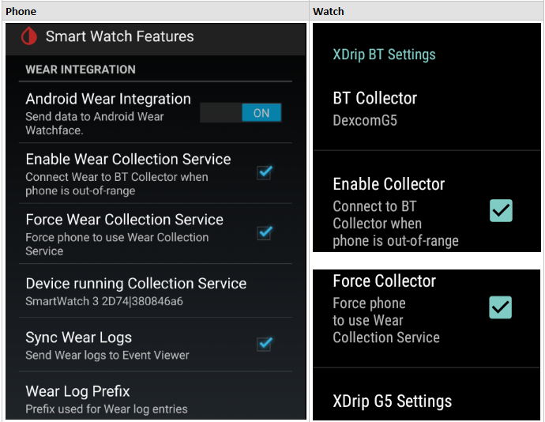

|Phone Settings                        | Watch Settings   | Description             |
| ------------------------------------ | ---------------- | ------------------------|
| Android Wear Integration             | NA               | Enables Wear integration|
| Enable Wear Collection Service       | Enable Collector | Enables the BT Collector to run on the wear device when the smartphone is out-of-range.|
| Force Wear Collection Service        | Force Collector  | Forces the BT Collector to run on the wear device even when the smartphone is in-range.|
| Disable Force on Low Batterty        | NA               | Disables Force Wear Collection Service on a Wear Low Battery Alert.  Low Battery is determined by Alarms and Alerts -> Extra Alerts (xDrip+) -> **Collector Battery Alerts**.  See section Alerts under [XDrip BT Settings](#xdrip-bt-settings) below. |
| Disable Force on Missed Readings     | NA               | Disables Force Wear Collection Service on Wear Missed Reading.  When ON, the **Force Wear Collection Service** will be disabled after **Minutes since last Reading from Wear**, returning control back to the smartphone BT Collector. |
| Minutes since last Reading from Wear | NA               | Number of minutes since last BG reading that triggers **Disable Force Wear Collection Service** |
| Device running Collection Service    | NA               | Read-only; Displays the wear device running the BT Collector.  This will be the watch display name + uuid when Force Wear is enabled. |
| NA                                   | BT Collector     | Read-only; Corresponds to xDrip+ Setting -> **Hardware Data Source**.  For example, if the **Hardware Data Source** is set to **G5 Transmitter (test)**, then the wear app BT Collector will display **DexcomG5**. |
| Sync Wear Logs                       | NA               | Triggers Wear log entries to be synced to the phone. You can view the logs on your phone using xDrip+ app's upper, right menu item, **View Events Log**. You need to enable ExtraLogTags in xDrip+ Settings -> LCS -> Extra Logging Settings -> **Extra tags for logging** to enable log generation for services s.a. **G5CollectionService:v**.|
| Wear Log Prefix                      | NA               | The wear event logs are prefixed with the **Wear Log Prefix**.  If you tap it, you'll see that it defaults to **wear** but you can enter something else, or nothing. This prefix helps to distinguish where the log entry was generated since services are similarly named on both devices. For example, **wearG5CollectionService** indicates the log was generated on the wear device.|

These settings are listed in order of dependency.  Note, the Watch's **XDrip BT Settings** will only be visible when Wear Integration is enabled on the phone.

* **Enable Wear**

  If you ONLY want to use the watch in standalone mode when the phone is out-of-range, then just select the Enable Wear checkbox. This simply enables the BT collection service on the watch to run only when the phone is out-of-range. Upon reconnecting to the phone, the watch will stop its BT collection service and send its BG readings. The phone will sync the received readings and startup its own BT collection service. There may be a delay, perhaps up to 14 minutes, on some smartphones (eg., if the smartphone has poor BT connectivity) to get an initial bg reading after it is switched back to the phone.
* **Force Wear**

  Enabling **Force Wear** will cause xDrip+ to use the watch BT collection service.  The watch BT collection service will sync each bg reading with the phone as readings are received from the collector, or upon reconnecting to the phone.  **Force Wear** for everyday use has the advantage of offloading some of the proccessing required on the smartphone to the watch, thus saving battery and CPU usage on the smartphone.

  However, this offloading means the watch battery may not last as long as when not using Force Wear.  As an example, some users find that the Sony Smartwatch 3 (SW3) can use 20%+ overnight (7-8 hrs) when unplugged and running G5 collector and always-on screen.

  Force Wear may also provide better BT connectivity over that provided by the smartphone.  As an example, some users find that the SW3 provides better BT connectivity than their Samsung Galaxy Note 4 smartphone.

### Patching Watch Firmware

Out of the box, only the Sony SW3 works as a collector with the G5 Transmitter. Most other smart-watches have a bug which prevents their bluetooth working correctly. This bug can be fixed and there are patches available for a number of watch models. See this page for details: https://github.com/NightscoutFoundation/xDrip/wiki/Patching-Android-Wear-devices-for-use-with-the-G5

### Collector

The **BT Collector** is a read-only preference on the watch XDrip Prefs.  It corresponds to xDrip+ Setting -> **Hardware Data Source**.

The following images show the setting of **Hardware Data Source** to **LimiTTer** and its corresponding setting on the watch.

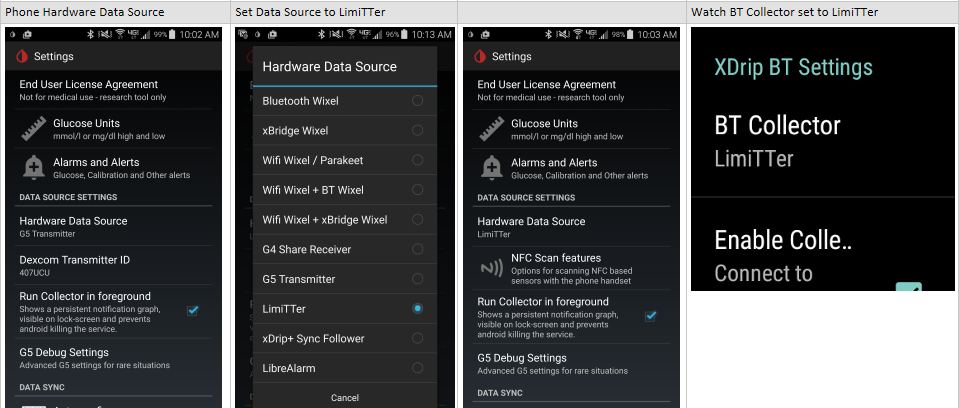

This preference indicates which BT Collector the watch will run to communicate with the BG transmitter when watch is in standalone mode.

#### xDrip+ System Status
The xDrip+ System Status screen supports individual status pages for the BT Collector.  This enables users to easily identify which device is running the BT Collector.

The following images show the System Status pages including one for the G5 Collector.

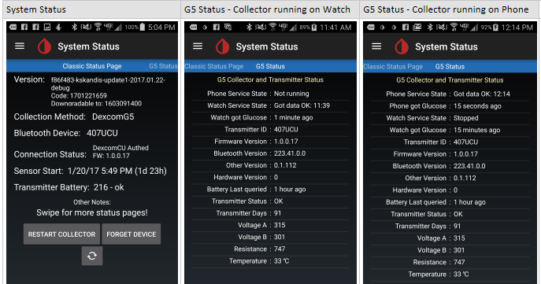


### Initial Wear Enablement Requests Location Permission
Initial enablement of standalone wear is triggered by selecting the the Enable Wear preference on watch or phone.

This will trigger the **Location Permission is Required** dialog box to be displayed.  Android Wear requires **Location Access** to be manually accepted by the user, therefore, the user **must** accept the Location Permission query in order for standalone mode to work.  Alternatively, the user can enable Location Permission in Watch -> Settings -> Permissions - XDrip Prefs, then enable Location.

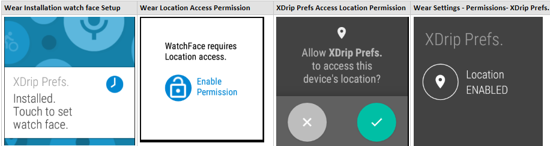

### Syncing Phone and Wear Preferences
Note, xDrip+ and Wear will sync their co-existing preferences.  Preference syncing takes the following precedence on connection:

  1. xDrip+ app startup.  xDrip+ will send its preferences to the watch and the watch will update its values to the phone.
  2. On re-connect, the wear app will send its preferences to the phone and phone will update its values to the watch.

For example, if the user changes the Force Wear preference on the watch, it will immediately be sent to the phone upon re-connection, and the phone will update its settings.

### Syncing BGs and Wear Database
* Sync DB - The watch data (BGs, Logs)are saved in the watch database.  The watch will attempt to sync its data with the phone upon connection until all delta data have been synced. So, for example, if you have 8 hours of overnight data generated while disconnected from the phone, the watch will attempt to send all data upon re-connection with the phone.
* Resetting the Wear DB - The watch data exists on the phone until you:

  1. **Reset Wear DB** on the phone via the xDrip+ upper right menu.  This task deletes the wear database, then initializes it with the most recent calibrations & BGs from the phone.
  This task may be useful if the wear app is not responding appropriately.  Refer to [Confirm Collector runs on the Watch with Wear Integration](#confirm-collector-runs-on-the-watch-with-wear-integration) below.
  2. **Sync Wear DB** is auto-executed on a daily basis at 4 am.  This task will removes all data from the database which have already been synced with the phone.
  3. The app is uninstalled.

* UserError Table - Similar to the xDrip+ phone app, UserError log messages are saved in the watch UserError table.  To access the watch log entries on the phone, enable the **Sync Wear Logs** preference shown in the above image.  The log entries will be prefixed with the **Wear Log Prefix**, which defaults to **wear**, but is user-configurable.  This allows users to identify which device generated the log entry.  The log entries can be viewed using the follwoing options:
  - Users can view log messages on the phone via the xDrip+ upper right menu item, **View Events Log**.
  - As with the xDrip+ phone app, specific log entries can be enabled by entering the extra log tag and severity level preference via the xDrip+ phone app settings, Less Common Settings (LCS) - Extra Logging Settings - **Extra tags for logging**.

The following image shows an example of the phone **View Events Log** containing phone and watch log entries.

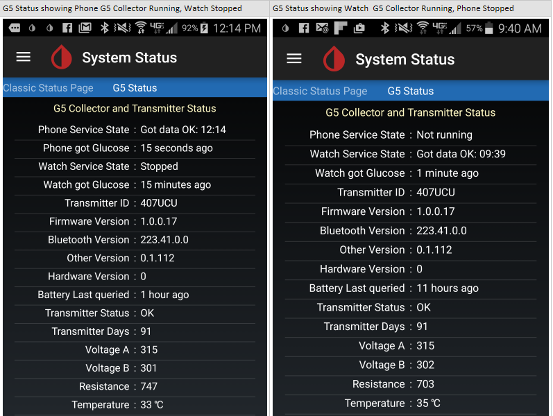

### XDrip Prefs Overview
The watch XDrip Prefs app is used to set the xDrip+ wear app preferences.  In addition to the Wear Integration preferences mentioned above under [Enable xDrip+ Android Wear Integration](#enable-xdrip-android-wear-integration), XDrip Prefs provide the following new preferences used in the standalone version.

#### XDrip BT Settings

  - XDrip G5 Settings

    Wear provides G5 BT settings similar to those provided by the xDrip+ app, such as **Scan for G5 Contantly**, under **G5 Debug Settings**.  As with the xDrip+ app, they should only be enabled if the watch has connectivity issues.

    For example, many users find that the **Sony Smartwatch 3 (SW3)** does not require any of these settings enabled.
    While other SW3 users find enabling **Scan for G5** helpful.

    Some users of the **Moto 360 2nd Gen** watch report the **Unbond G5/Read** pref is required.

    There are the following two, known exceptions:
    - **Force Screen On** - Some watches, such as the **Moto 360 2nd Gen**, fall into deep sleep preventing the BT Collector from retrieving the transmitter data.
    Enabling this preference will trigger the watch to wakeup to read the transmitter data, then fall back to sleep.
    This preference is **experimental** but may be helpful for watches that do not support the **Always-on screen** feature.

      Rather than use this preferences, it is recommended that users enable **Always-on screen** on their watch or Android Wear app, when supported.  The **Moto 360 2nd Gen** is currently the only known watch that does not support **Always-on screen**.

      The following image shows an example of the **Always-on Screen** setting in Android Wear and on the watch settings.

      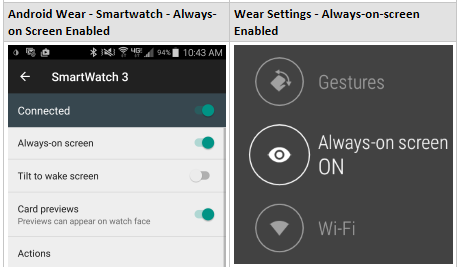

    - **Auth G5/Read** - This should be enabled if using the latest, Dexcom G5 transmitter firmware (released in November 2016, **firmware 1.0.4.10**, or newer than **firmware 1.0.0.17**).

  - Alerts

    Alerts can be enabled on the watch when in standalone mode (i.e., when Force Wear is enabled) by enabling **Enable Alerts** and **High Alerts** on the watch.  This will allow alerts to be triggered when disconnected from the phone.  Currently the following xDrip+ app alerts under **Alarms and Alerts** are supported on the watch:

    1. **Alert List** - All alerts.
    2. **Other Alerts** - **Bg falling fast** and **Bg risng fast**.
    3. **Extra Alerts (xDrip+)**
       1. **Persistent High Alert** - configured on watch by enabling **High Alerts**.
       2. **Collector Battery Alerts** - this alert applies to the BT Collector running on phone or watch.
       If the collector is running on the watch, battery refers to the watch battery for G4 and G5, for other non-G5 BT Collectors, battery refers to those devices communicating with the transmitter.  Battery level is checked upon each transmitter BG reading.

    **Glucose Alerts Settings** are currently not configurable for the watch.  Watch alerts use following defaults:

        1. Vibrate-only Profile
        2. Smart Snoozing.
        3. Smart Alerting.

The following image shows xDrip+ app alerts under **Alarms and Alerts** which are supported on the watch.

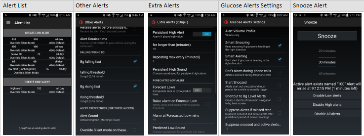

The following images show watch alert preferences and example alerts.

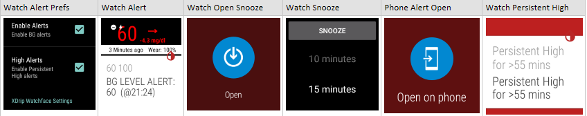

Users will continue to receive those phone alerts which are not supported on the watch.

Phone and watch alerts can be distinguished by their **Open** dialog.  The phone alert will display **Open on phone**.  Whereas the watch alert will display **Open** dialog.  Upon tapping Open, the Snooze dialog will be displayed on the watch.

The watch Snooze performs the same functionality that the phone Snooze performs.  Tapping the Snooze button and number from the NumberPicker, on either device, will snooze the alert on both the phone and the watch.  The snoozed active alert will trigger a toast message on the paired device to alert the user of the snooze.

Note, tapping the other Snooze buttons, such as **Disable All alerts** will only snooze the alarms on the active device.

The following image shows xDrip+ app Battery Alert under **Extra Alerts (xDrip+)** and example alerts on both devices.

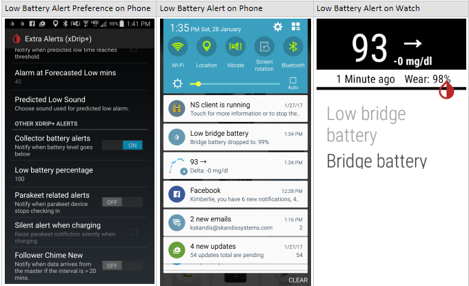

#### XDrip Watchface Settings
The following new preferences are supported:
  - Refresh On Change - Refresh face on each data change.  When disabled, face is refreshed only each minute, potentially saving battery usage.
  - Show Treatments - Show Treatment points on graph.  When disabled, treatments will not be displayed, potentially saving battery usage.
  - 24 HR Format - Format time using 24 Hour Format.  When enabled, uses less face real estate, potentially useful for circular faces.
  - Show Date - Show Date on face.
  - Override Locale - Override watch with phone locale, used to format date.
  - Show Toasts - Show Steps and Extra Status toast popup messages.
  - Show Steps - Show Step Counter on all XDrip watchfaces.  Steps reset to 0 at midnight. To enable xDrip+ synchronization, you must switch **Use Wear Health Data** on under xDrip+ **Smart Watch Features**. When enabled, wear steps will be synced to xDrip+.
  - Step Delay - Select time delay from the list preferences.  Step Delay is maximum reporting latency. Events are batched up until this "maximum" latency has lapsed. Once lapsed all batched up events will occur sequentially.
  This is a way to save power consumption so that each event does not interrupt the processer. If you find 10 seconds uses too much power you can select a larger latency. This will of course effect the frequency at which the display of the steps is updated on the watch. Defaults to 10 seconds.  To conserve wear battery, select 5 minutes.
  - Heart Rate - Show last BPM is supported by device.
  - Show Status - Show Loop Status on the XDrip, XDrip(Large) and XDrip (BigChart)watchfaces.  This will display the HAPP status message containing Basal%, IOB, COB.
  - Opaque Card - Show notifications cards with opaque background.  This will allow cards to be read more easily in ambient mode.
  - Small Font - Fontsize of small text in status and delta time fields on the XDrip and XDrip(Large) watchfaces.
  - Show Bridge Battery - Show bridge battery usage on the XDrip and XDrip(Large) watchfaces.  This setting will only be displayed when the BT Collector uses a battery, for example, LimiTTer or Wixel/xBridge.

The following images show some of the watchface preferences under XDrip Watchface Settings.

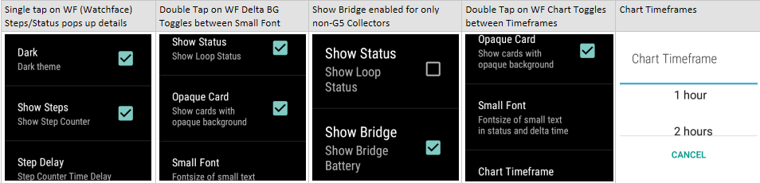

The following images show an example of an alert displayed with Opaque Card enabled and disabled in Ambient Mode and Interactive Mode.

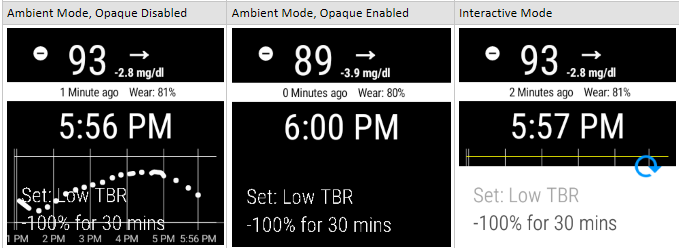

The following images show required xDrip+ preferences and examples of Watch Steps synced with xDrip+.

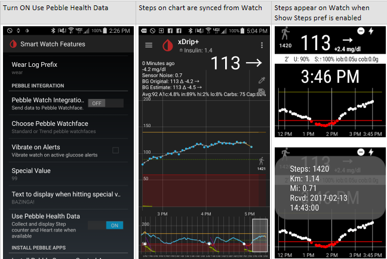

#### Use Android Wear complication since Wear 2.0

You can also install Watchfaces supporting ```complication```, for example:

https://play.google.com/store/apps/details?id=co.smartwatchface.watch.face.aviator.android.wear&hl=en_US

How-to use:
* long press on watchface
* open settings
* complication
* 3rd party
* select where to place complication
* select xdrip pref

If placing right or left, it looks like this:

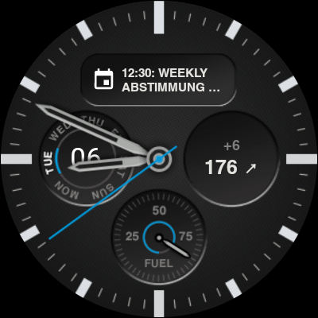

* If under xdrip settings you have selected ```Loop status``` and placing up or bottom, it looks like this:

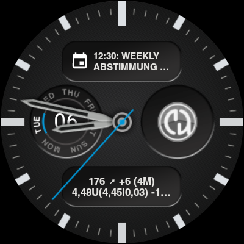

If getting "Null, Null" displayed, try to add a blood calibration (see https://github.com/NightscoutFoundation/xDrip/issues/651)


#### Watchface Tap Feature
Watchface tap feature is now implemented for the following preferences:
* Chart Timeframe - double tap on the chart in any of the watchfaces will toggle the chart timeframe allowing one to zoom in/out of a frame.
* Small Font - double tap on the delta time in the XDrip or XDrip(Large) watchface will toggle the fontsize of the delta and status line text for ease of viewing.
* Status Line - single tap on the status line in the XDrip or XDrip(Large) watchface will popup a toast message containing the full text for ease of viewing.

The following images show an example of the HAPP message and its integration with xDrip+ watchface.


#### Battery Usage
The wear app supports the display of two battery usage options:
* Bridge - displays the wixel or LimiTTer battery usage.  The Show Bridge Battery must be enabled to display the bridge battery usage.
* Uploader or Wear - will display the battery usage of the device running the collection service.  So, if Enable Wear and Force Wear prefs are enabled, it will display the **watch** battery usage.  If only Enable Wear is enabled, then it will display the battery usage of whichever device is actually running the collection service.  If neither prefs are enabled, it displays the phone's battery usage.  The label, **Uploader** or **Wear** corresponds to the device running the collector.  **Uploader** for phone which is the default, and **Wear** for the watch.  This will allow users to identify which device is running the collection service.

The following images show an example of BT Collector running under each device, with and without Show Status enabled, and Chart Timeframe toggled.

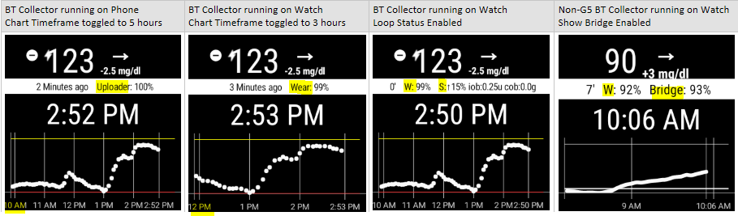

For G4 and G5 BT Collectors, when BT Collector is running on the Phone, the battery usage displays the phone's battery usage as indicated by its label, "Uploader".
When BT Collector is running on the watch, battery usage shows the watches' battery usage as indicated by its label, "Wear".
When the BT Collector is connected to a bridge device, the battery usage displays that device's battery usage as indicated by its label, "Bridge".

## 3-Dot Menu
The 3-dot Menu icon is displayed in the upper, left corner on the XDrip watchface, below the Steps icon if enabled.  Tapping it will activate a new activity with two rows of 4 icons, each with a separate task as shown in the following screenshot.

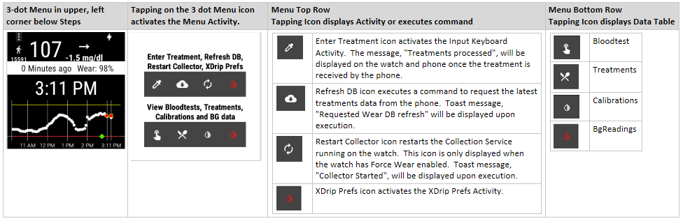

The second row of icons in the Menu allow the user to view data tables as shown in the following examples.

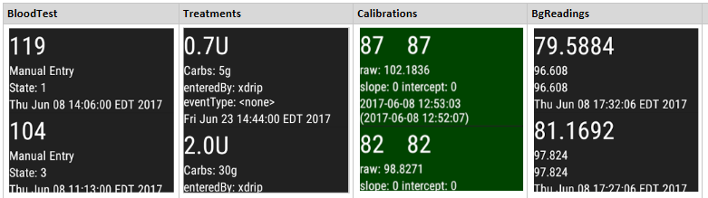

## XDrip Treatments
Treatment data points can be displayed on the watchface graph by enabling the "Show Treatments" preference, either on the Phone under Wear Integration, or via the watch XDrip Prefs activity as shown in the following screenshot.

Once enabled, treatments entered via the phone or watch UI will be displayed on the watch.  Insulin, Carbs, Notes are displayed with a green diamond.  Bloodtests are displayed with a red square, and Calibrations are displayed with a red circle.  Each of these are outlined with a yellow rim for a 3-dimensional effect.  Treatments entered on the watch will be saved to the Wear database and posted to the phone upon next connection.  Likewise, treatments entered on the phone will be posted to the watch upon next connection so that data should remain in-sync when Show Treatments is enabled.

Note, this process only supports treatments entered by the Keyboard Input Activity.  Spoken Treatment is currently not supported since many watches do not support speech recognition well.  Treatments entered via the Spoken Treatment Activity continues to work as before and requires a connection to the phone for data to be processed.
Here is the typical setup and process on the watch for Spoken Treatments.

	1. Associate the Spoken Treatment app with "Take a note" Action in your phone's Android Wear for the watch. Your phone may also have the option to select Google Keep as well.
	2. Say "Ok Google" to your watch.  It is slow so you have to speak clearly. Then say, "Take a note". The watch should display the speak icon.
	3. Then speak your treatment, slowly and distinctly, for example, "1 carb".  This activates the Spoken Treatment activity with the mic icon. Press the mic icon, and the approval screen should be displayed.

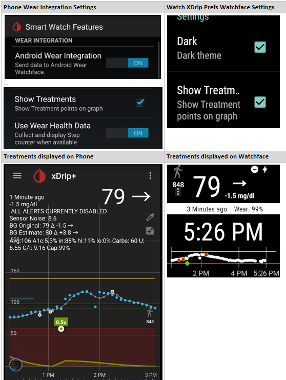

The following screenshot shows an example of entering Treatments on the watch.

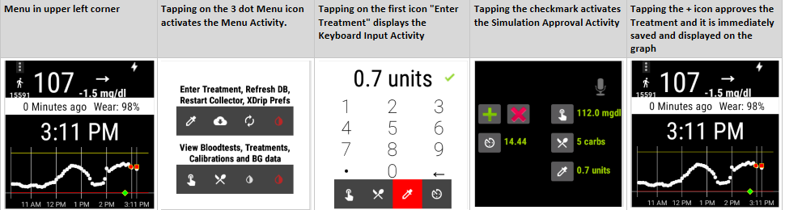

## Troubleshooting xDrip Wear
The BT Collector connects to the transmitter every 5 mins by design. This is how the Collector's BLE works. The following provides some troubleshooting suggestions if readings are not being receiving every 5 minutes.

### Confirm Collector runs on the Phone with Wear Integration

  Ensure Wear Integration preferences are set as follows:
  - **Wear Integration** is enabled.
  - **Enable Wear** is selected.
  - **Force Wear** is **NOT** selected.

This will allow your phone to use the G5 collector as normal when both phone and watch are in-range. After receiving a reading on your phone, ensure it displays on your watch.

After you confirm that you are get a reading on your phone, enable **Force Wear**, either on the phone or watch XDrip Prefs.

This will force the watch to use its BT collector, and force the phone to stop its BT collector service discussed next.

### Confirm Collector runs on the Watch with Wear Integration
  Ensure Wear Integration preferences are set as follows on both phone and watch:
  - **Wear Integration** is enabled.
  - **Enable Wear** is selected.
  - **Force Wear** is selected.
  - **Device running Collection Service** corresponds to the watch display name + uuid.
  - XDrip Prefs **BT Collector** corresponds to phone's Hardware Data Source.

  Confirm Environment:
  - Disable engineering mode.
  - Disable Calibration plugin (incl. Adrian calibration mode).
  - Disable then re-enable Wear Integration.
  - Enable Force Wear.
  - Show raw values.
  - Smooth sensor noise off.
  - Reset Wear DB, restart Watch, restart phone.
  - Confirm phone and watch are connected via Android Wear.
  - Change Watchface to big chart and then back to standard xDrip.
  - Optionally, perform **Reset Wear DB** from xDrip+ upper, right menu.  Refer to [Syncing BGs and Wear Database](#syncing-bgs-and-wear-database) above.

### Confirm the following in Android Wear app on phone
- Watch is connected to the phone.
- Watch Settings **always-on screen** is enabled.  This will prevent watch doze mode from shutting down the BT Collector.
Refer to [XDrip BT Settings](#xdrip-bt-settings) above for additional details.

  To verify devices are connected, check the phone Android Wear app.  Android wear (on the watch) displays the **cloud** icon if the devices are not in-range, or if the user manually disconnects the devices in Android Wear.

  Similarly, some users have found it necessary to enable the **Stay awake while charging** setting under their watch Settings **Developer Options**.  In testing thus far, only the **Moto 360 2nd Gen** watch has required this option.

### Confirm Wear Integration preferences are consistent on both phone and watch

  **Enable Wear** and  **Force Wear** should have same settings on phone and watch.  If not, reset them accordingly.  The xDrip+ should sync these values whenever the user modifies them or at application startup, but both phone and watch must be connected and in-range for syncing to be performed.

### Confirm Collection Method is consistent on both phone and watch

  Confirm the phone's Hardware Data Source preference matches the watch's BT Collector preference.  The watch's BT Collector preference is a read-only preference.  It gets set based on the phone's Hardware Data Source preference. The following values correspond to the collectors:
   - BluetoothWixel("BluetoothWixel"),
   - DexcomShare("DexcomShare"),
   - DexbridgeWixel("DexbridgeWixel"),
   - LimiTTer("LimiTTer"),
   - WifiWixel("WifiWixel"),
   - DexcomG5("DexcomG5"),
   - WifiDexBridgeWixel("WifiDexbridgeWixel"),
   - LibreAlarm("LibreAlarm")

Refer to [Collector](#collector) above for additional details.

### Confirm Collector device exists under Watch Settings BT Devices

  Once the BT Collection Service executes it will perform a BT scan, and upon detecting the BT Collector device, will display under the Watch Settings -> Bluetooth Devices.  Typically it will show as disconnected as it only connects briefly to receive the BG reading.

### Confirm Calibration Preferences are consistent on both phone and watch

  The watch app does not yet support Calibration Plugins.  Therefore, to confirm BG readings are consistently calculated on both phone and watch, it is best to turn off Calibration Plugins on the phone.
  - LCS - **Advanced Calibration** - all should be off, including **Adrian calibration mode**.

### Confirm Noise Preferences are consistent on both phone and watch

  The watch app does not yet support Noise smoothing.  Therefore, to confirm BG readings are consistently calculated on both phone and watch, it is best to turn off Noise Smoothing on the phone.

  - xDrip+ Display Settings - **Show Noise workings** should be disabled.

    When Show Noise Workings is enabled, **BG Original** and **BG Estimate** will display on the home screen.
    - BG Original should correspond to your watch value, and
    - BG Estimate should correspond to your phone value.

  - xDrip+ Display Settings - **Smooth Sensor Noise** should be disabled.

### Confirm Location Permission is enabled in Watch Settings

  Android Wear requires Location Access to be manually accepted by the user.

  However, sometimes the user overlooks this dialog.

  Further, this preference may appear to be enabled under the Watch -> Settings -> Permissions - XDrip Prefs, when it actually is DISABLED, perhaps an Android Wear bug.
  Evidence of this can be seen in the Events log (refer to [Syncing BGs and Wear Database](#syncing-bgs-and-wear-database) UserError Table) with the following log entry:
  ```
    E/jamorham JoH: Could not set pairing confirmation due to exception: java.lang.SecurityException: Need BLUETOOTH PRIVILEGED permission: Neither user 10035 nor current process has android.permission.BLUETOOTH_PRIVILEGED.
  ```
  This message appears to occur only once, so it is easily missed if logging is not enabled via the Sync Wear Logs preference.

  However, this Permission is required, and therefore, if not enabled, the Collection Service will not be able to connect to the transmitter via BLE.
  Connection errors such as the following (for G5CollectionService, DexcomG5 Hardware Service) will continued to be logged to the Events log:

  ```
  06-10 07:47:03.427 2162-2172/? E/G5CollectionService: Encountered 133: true

  06-10 07:57:14.936 2162-2173/? I/G5CollectionService: Read code: 7 - Transmitter NOT already authenticated?
  06-10 07:57:14.937 2162-2173/? E/G5CollectionService: Sending new AuthRequestTxMessage to Authentication ...
  06-10 07:57:14.958 2162-2173/? D/G5CollectionService: New AuthRequestTxMessage: 01346163356234373302
  06-10 07:57:14.959 2162-2173/? I/G5CollectionService: AuthRequestTX: 01346163356234373302
  06-10 07:57:14.961 2162-2173/? E/G5CollectionService: OnCharacteristic READ finished: status: Gatt Success
  06-10 07:57:14.984 2162-2173/? E/G5CollectionService: STATE_DISCONNECTED: Connection terminated by peer
  ```

  Causing the Collector to restart Bluetooth:
  ```
  06-10 07:57:15.183 2162-2751/? E/G5CollectionService: Cycling BT-gatt - disabling BT
  ...
  06-10 07:57:18.204 2162-2752/? E/G5CollectionService: Cycling BT-gatt - enabling BT
  ```

  The following steps are recommended for resolution:
  1. Toggle the ```Location ENABLED preference``` to disable it under Watch Settings (refer to [Initial Wear Enablement Requests Location Permission](#initial-wear-enablement-requests-location-permission)).
  2. Restart the Collector on Wear (refer to [3-Dot Menu](#3-dot-menu) Restart Collector or alternatively, Restart Collector in xDrip+ System Status).  This should force the Location Access Permission dialog to be displayed on the watch for user acceptance.
  3. Or, if the above fail to resolve the issue, uninstall then reinstall the Wear app.  This will force the Location Access Permission dialog to be displayed on the watch for user acceptance.

# ADB DEBUG
### Debugging Android Wear
[Howto Enable Debugging](http://www.androidpolice.com/2014/07/05/how-to-android-wear-enable-debugging-take-screenshots-unlock-the-bootloader-and-root-the-lg-g-watch/)

1. Open Settings.
	1. Tap on Wear's watch face. This will take you to the voice prompt. Be sure to hit the watch face instead of a notification card.
	2. Wear will wait up to 3 seconds for you to say something, then it'll change to a scrollable list of native actions. You can speed this up by swiping up or tapping on the voice prompt.
	3. Scroll down and select Settings.
2. Open About.
3. Find Build number and tap on it 7 times. You're done when a toast popup appears with the message, "You are now a developer!"
4. Swipe right (to go back) to the Settings menu.
5. Open Developer options.
6. Find and set ADB debugging to Enabled.
7. You'll be asked if you're sure you want to enable. Tap the checkmark button to confirm.
8. [Optional] If you want to also turn on debugging over Bluetooth, Find and set Debug over Bluetooth to Enabled.

At the terminal, issue:

```
D:\Android\sdk\platform-tools>adb devices
List of devices attached
14502D1AF252D74 device
D:\Android\sdk\platform-tools>adb -s 14502D1AF252D74 logcat > wear.log
```
If you see **unauthorized** description of your device, ensure that ADB debugging is enabled on your watch under Developer Options.

Enter the following cmd to generate a logcat log, where -s arg is your watch device if you have more than one device connected to your computer, otherwise, omit the -s arg. You can retrieve the device id using cmd adb devices: 

```
D:\Android\sdk\platform-tools>adb devices
D:\Android\sdk\platform-tools>adb -s 14502D1AF252D74 logcat > wear.log
```


### Help my NFC patched Sony SmartWatch 3 doesn't work with xDrip as a collector

The problem typically is the version of Google Play Services on the watch. You need at least 9.x installed.

On the watch check the version with `Settings` -> `About` -> `Versions`

If your google play services version is less than 9, then you should install version 9.

This is available from unofficial sources which you can find by googling, for example:

https://www.apkmirror.com/apk/google-inc/google-play-services-android-wear/google-play-services-android-wear-9-8-41-release/google-play-services-9-8-41-534-130237018-android-apk-download/

To install, connect your watch via usb and make sure adb debugging is enabled. You should be familiar with this process from how you originally installed the custom NFC firmware.

use the command:

`adb install -r downloaded-filename.apk`
