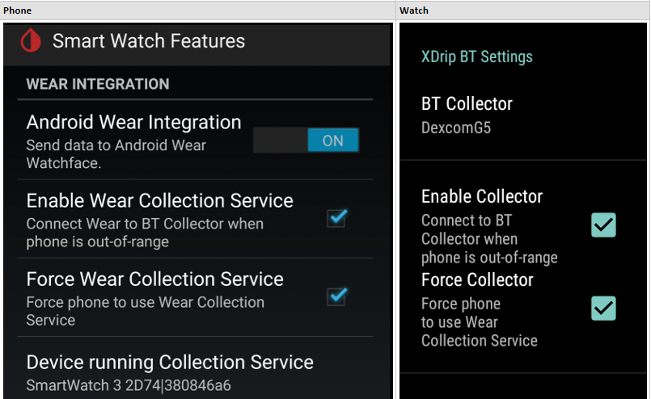

# xDrip+ Wear Setup and Troubleshooting Guide
##Enable xDrip+ Android Wear Integration
xDrip+ supports wear integration through its wear app.  The xDrip+ wear app is installed with the standard xDrip+ apk.  The latest release supports a standalone version which allows the wear app to communicate directly with the Bluetooth collector, whether it is a Dexcom G5, a Dexcom G4 + xBridge, or a Libre LimiTTer.

The wear standalone feature is enabled via the following xDrip+ Settings located under **Smart Watch Features**, and corresponding watch **XDrip Prefs** settings:

|Phone        Settings              | Watch       Prefs| Description             |
| --------------------------------- | ---------------- | ------------------------|
| Android Wear Integration          | NA               | Enables Wear integration|
| Enable Wear Collection Service    | Enable Collector | Enables the BT Collector to run on the wear device when the smartphone is out-of-range.|
| Force Wear Collection Service     | Force Collector  | Forces the BT Collector to run on the wear device even when the smartphone is in-range.|
| Device running Collection Service | NA               | Read-only; Displays the wear device running the BT Collector.  This will be the watch display name + uuid when Force Wear is enabled. |
| NA                                | BT Collector     | Read-only; Corresponds to xDrip+ Setting - Hardware Data Source.  For example, if the xDrip+ is set to G5 Transmitter (test), then the wear app BT Collector will display **DexcomG5**. |

These settings are listed in order of dependency.


[xDrip+ Wear Integration Preferences](images/prefs-wear-sync.png)

* **Enable Wear**

  If you ONLY want to use the watch in standalone mode when the phone is out-of-range, then just select the Enable Wear checkbox. This simply enables the BT collection service on the watch to only run it when the phone is out-of-range. Upon reconnecting to the phone, the watch will stop its BT collection service and send its BG readings. The phone will sync the received readings and startup its own BT collection service. There may be a delay, perhaps up to 14 minutes, on some smartphones (eg., if the smartphone has poor BT connectivity) to get an initial bg reading after it is switched back to the phone. The watch BT collector usually gets the very next reading with no delay.
* **Force Wear**

  Enabling **Force Wear** will cause xDrip+ to only use the watch BT collection service.  The watch BT collection service will sync each bg reading with the phone as readings are received from the collector, or upon reconnecting to the phone.  **Force Wear** for everyday use has the advantage of offloading some of the proccessing required on the smartphone to the watch, thus saving battery and CPU usage on the smartphone.

  However, this offloading means the watch battery may not last as long as when not using Force Wear.  For example, some users find that the Sony Smartwatch 3 (SW3) can use 20%+ overnight (7-8 hrs) when unplugged and running G5 collector and always-on screen.

  Force Wear may also provide better BT connectivity over that provided by the smartphone.  For example, some users find that the Sony Smartwatch 3 provides better BT connectivity than their smartphone.

###Syncing Phone and Wear Preferences
Note, xDrip+ and Wear will sync their co-existing preferences.  Preference syncing takes the following precedence on connection:
1. xDrip+ app startup.  xDrip+ will send its preferences to the watch and the watch will update its values to the phone.
2. On re-connect, the wear app will send its preferences to the phone and phone will update its values to the watch.

For example, if the user changes the Force Wear preference on the watch, it will immediately be synced with the phone, or synced upon connection.

###Syncing BGs and Wear Database
* Sync DB - The watch data is saved in the watch database.  The watch will attempt to sync with the phone upon connection until all delta data have been synced. So, for example, if you have 8 hours of overnight data, the watch will attempt to send those upon initial connection with the phone.
* Reset Wear DB - The watch data exists on the phone until you **Reset Wear DB** on the phone via the xDrip+ upper right menu or until the app is uninstalled.
* UserError Table - Similar to the xDrip+ phone app, UserError log messages are saved in the watch UserError table.
  - View Events Log - Users can view log messages on the phone via the xDrip+ upper right menu item **View Events Log**.
  - Less Common Settings (LCS) - Extra Logging Settings - **Extra tags for logging**: As with the xDrip+ phone app, specific log entries can be enabled by entering the extra tag and severity level preference via the xDrip+ phone app.

###XDrip Prefs Overview
The watch XDrip Prefs app is used to set the xDrip+ wear app preferences.

The following list the new preferences used in the standalone version.
* XDrip BT Settings - provides the Wear Integration preferences listed above and the following:
  - XDrip G5 Settings - similar to those provided by the xDrip+ app, such as **Scan for G5 Contantly**.  As with the xDrip+ app, they should only be enabled if the watch has connectivity issues.  For example, the Sony Smartwatch 3 (SW3) does not require any of these setting.
    - The one exception is the **Auth G5/Read**.  This should be enabled if using the latest, Dexcom G5 transmitter firmware (released in November 2016, firmware 1.0.4.10, or newer than firmware 1.0.0.17).

* XDrip Watchface Settings
  - Show Status - Show Loop Status on the XDrip and XDrip(Large) watchfaces.  This will display the HAPP status message containing Basal%, IOB, COB.
  - Opaque Card - Show notifications cards with opaque background.  This will allow cards to be read more easily in ambient mode.
  - Small Font - Fontsize of small text in status and delta time fields on the XDrip and XDrip(Large) watchfaces.
  - Show Bridge Battery - Show bridge battery usage on the XDrip and XDrip(Large) watchfaces.  This setting will only be displayed when the BT Collector uses a battery, for example, LimiTTer or Wixel/xBridge.

####Watchface Tap Feature
Watchface tap feature is now implemented for the following preferences:
* Chart Timeframe - double tap on the chart in any of the watchfaces will toggle the chart timeframe allowing one to zoom in/out of a frame.
* Small Font - double tap on the status line or the delta time in the XDrip or XDrip(Large) watchface will toggle the fontsize allowing one to toggle size of the text for ease of viewing.

####Battery Usage
The wear app supports the display of two battery usage options:
* Bridge - displays the wixel or LimiTTer battery usage.  The Show Bridge Battery must be enabled to display the bridge battery usage.
* Uploader or Wear - will display the battery usage of the device running the collection service.  So, if Enable Wear and Force Wear prefs are enabled, it will display the **watch** battery usage.  If only Enable Wear is enabled, then it will display the battery usage of whichever device is actually running the collection service.  If neither prefs are enabled, it displays the phone's battery usage.  The label, **Uploader** or **Wear** corresponds to the device running the collector.  **Uploader** for phone which is the default, and **Wear** for the watch.  This will allow users to identify which device is running the collection service.

##Troubleshooting xDrip+ Wear
The BT Collector connects to the transmitter every 5 mins by design. This is how the Collector's BLE works. The following provides some troubleshooting suggestions if readings are not being receiving every 5 minutes.

###Confirm the following in Android Wear app on phone
- Watch is connected.
- Watch Settings always-on screen is enabled.  This will prevent watch doze mode from shutting down the BT Collector.

  To verify devices are connected, check the phone Android Wear app.  Android wear (on the watch) displays the **cloud** icon if the devices are not in-range, or if the user manually disconnects the devices in Android Wear.
	
###Confirm Wear Integration preferences are consistent on both phone and watch.

  **Enable Wear** and  **Force Wear** should have same settings on phone and watch.  If not, reset them accordingly.  The xDrip+ should sync these values whenever the user modifies them or at application startup, but both phone and watch must be connected and in-range for syncing to be performed.  See **Confirm phone and watch are connected** above.

###Confirm Collection Method is consistent on both phone and watch.

  Confirm the phone's Harware Data Source preference matches the watch's BT Collector preference.  The watch's BT Collector preference is a read-only preference.  It gets set based on the phone's Hardware Data Source preference. The following values correspond to the collectors:
   - BluetoothWixel("BluetoothWixel"),
   - DexcomShare("DexcomShare"),
   - DexbridgeWixel("DexbridgeWixel"),
   - LimiTTer("LimiTTer"),
   - WifiWixel("WifiWixel"),
   - DexcomG5("DexcomG5"),
   - WifiDexBridgeWixel("WifiDexbridgeWixel"),
   - LibreAlarm("LibreAlarm")

###Confirm Collector device exists under Watch Settings->Bluetooth -> Devices.

  Once the BT Collection Service executes it will perform a BT scan, and upon detecting the BT Collector device, will populated the Watch Settings under Bluetooth Devices.  Typically it will show as disconnected as it only connects briefly to receive the BG reading.

###Confirm Calibration Preferences are consistent on both phone and watch.

  The watch app does not yet support Calibration Plugins.  Therefore, to confirm BG readings are consistently calculated on both phone and watch, it is best to turn off Calibration Plugins on the phone.
  - LCS - **Advanced Calibration** - all should be off, including **Adrian calibration mode**.

###Confirm Noise Preferences are consistent on both phone and watch.

  The watch app does not yet support Noise smoothing.  Therefore, to confirm BG readings are consistently calculated on both phone and watch, it is best to turn off Noise Smoothing on the phone.

  - xDrip+ Display Settings - **Show Noise workings**

    When Show Noise Workings is enabled, **BG Original** and **BG Estimate** will display on the home screen.
    - BG Original should correspond to your watch value, and
    - BG Estimate should correspond to your phone value.

  - xDrip+ Display Settings - **Smooth Sensor Noise**

    For ease of confirming consistent BG readings on phone and watch, disable Noise Smoothing:


###Confirm Collector runs on the Phone with Wear Integration

  Ensure Wear Integration preferences are set as follows:
  - **Wear Integration** is enabled.
  - **Enable Wear** is selected.
  - **Force Wear** is **NOT** selected.

This will allow your phone to use the G5 collector as normal when both phone and watch are in-range. After receiving a reading on your phone, ensure it displays on your watch.

After you confirm that you are get a reading on your phone, enable **Force Wear**, either on the phone or watch XDrip Prefs.

This will force the watch to use its BT collector, and force the phone to stop its BT collector service discussed next.

###Confirm Collector runs on the Watch with Wear Integration
  Ensure Wear Integration preferences are set as follows on both phone and watch:
  - **Wear Integration** is enabled.
  - **Enable Wear** is selected.
  - **Force Wear** is selected.
  - **Device running Collection Service** corresponds to the watch display name + uuid.
  - XDrip Prefs **BT Collector** corresponds to phone's Hardware Data Source.

  Confirm Environment:
  - Disable engineering mode.
  - Disable Calibration plugin (incl. Adrian calibration mode).
  - Disable then re-enable Wear Integration.
  - Enable Force Wear.
  - Show raw values.
  - Smooth sensor noise off.
  - Reset Wear DB, restart Watch, restart phone.
  - Confirm phone and watch are connected via Android Wear.
  - Change Watchface to big chart and then back to standard xDrip.

  Confirm Environment:
  - Disable engineering mode

#ADB DEBUG
Debugging Android Wear
http://www.androidpolice.com/2014/07/05/how-to-android-wear-enable-debugging-take-screenshots-unlock-the-bootloader-and-root-the-lg-g-watch/
1. Open Settings.
   1. Tap on Wear's watch face. This will take you to the voice prompt. Be sure to hit the watch face instead of a notification card.
   2. Wear will wait up to 3 seconds for you to say something, then it'll change to a scrollable list of native actions. You can speed this up by swiping up or tapping on the voice prompt.
   3. Scroll down and select Settings.
2. Open About.
3. Find Build number and tap on it 7 times. You're done when a toast popup appears with the message, "You are now a developer!"
4. Swipe right (to go back) to the Settings menu.
5. Open Developer options.
6. Find and set ADB debugging to Enabled.
7. You'll be asked if you're sure you want to enable. Tap the checkmark button to confirm.
8. [Optional] If you want to also turn on debugging over Bluetooth, Find and set Debug over Bluetooth to Enabled.

At the terminal, issue:

```
D:\Android\sdk\platform-tools>adb devices
List of devices attached
14502D1AF252D74 device
D:\Android\sdk\platform-tools>adb -s 14502D1AF252D74 logcat > wear.log
```
If you see **unauthorized** description of your device, ensure that ADB debugging is enabled on your watch under Developer Options.

Enter the following cmd to generate a logcat log, where -s arg is your watch device if you have more than one device connected to your computer, otherwise, omit the -s arg. You can retrieve the device id using cmd adb devices: 

```
D:\Android\sdk\platform-tools>adb devices
D:\Android\sdk\platform-tools>adb -s 14502D1AF252D74 logcat > wear.log
```